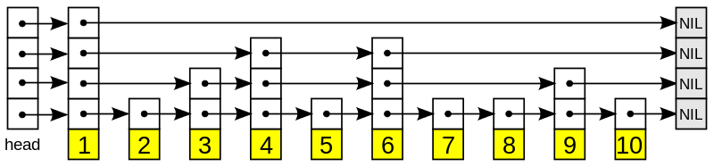

# leveldb

## put 流程简述

### 接口

```go
type LevelDb interface {
	Put(key, value []byte) error
}
```

### 说明

```text
// 写入速度下降的case：
//    当0层sstable文件多余8个时候，用户写会被降低；
// 写入被限制的case：
//    当0层sstable文件大于12个停止写入；
//    mem超过阈值转为imm，imm未持久化到sstable停止写入
// 触发合并的两个case:
//    0层超过4个文件开始合并
//    其他层数据库超过层级最大值开始合并
// 其他性能上的限制：
//    加锁，导致写只能串行；
//    cond引入导致可以写，但是提交时间会变长（返回时间变长）
//    其他场景通过内存拷本副本方式，降低block时间
```

## 层级打印

### 方法

```go
db.PrintMem()
db.PrintVersion()
```

### 案例

```bash
memory level 
    [level = 11] 
    [level = 10] 
    [level = 09] 
    [level = 08] 
    [level = 07] 
    [level = 06] 
    [level = 05] 
    [level = 04] 
    [level = 03] 
    [level = 02] 0-v1677 6-v1678 
    [level = 01] 0-v1677 2-v1683 3-v1684 6-v1678 
    [level = 00] 0-v1681 0-v1677 1-v1688 2-v1687 2-v1683 2-v1682 2-v1679 3-v1684 5-v1689 6-v1685 6-v1678 7-v1686 7-v1680
 
sstable level
    [level = 0] 01927.ldb 01929.ldb 
    [level = 1] 01925.ldb 00408.ldb 00174.ldb 
    [level = 2] 00995.ldb 00997.ldb 00996.ldb 00999.ldb 00998.ldb 01001.ldb 01000.ldb 01002.ldb 01003.ldb 00872.ldb 00723.ldb 00585.ldb 00420.ldb 00216.ldb 
    [level = 3] 01004.ldb 01006.ldb 01005.ldb 01007.ldb 01009.ldb 01008.ldb 01010.ldb 01012.ldb 01011.ldb 00044.ldb 00014.ldb 00013.ldb 00059.ldb 00029.ldb 
    [level = 4] 00422.ldb 00421.ldb 00465.ldb 00464.ldb 00463.ldb 00468.ldb 00467.ldb 00466.ldb 00504.ldb 00506.ldb 00505.ldb 00507.ldb 00510.ldb 00509.ldb 00508.ldb 
    [level = 5] 
    [level = 6] 
```

level0有重复数字是因为多版本导致。

memory level 就是博客中看得到的如下结构



sstable levle 就是博客中看到的下图蓝色部分


## 参考链接

- https://wingsxdu.com/post/database/leveldb/#minor-compaction&gsc.tab=0
- https://zhuanlan.zhihu.com/c_1258068131073183744